# VectorX — WRO Future Engineers 2026

**Team 1358 · India · Asia Pacific**

<p align="center"></p>

*Three students, one 3D-printed car, and a season spent making it finish the course the same way twice.*

- **Open Challenge video:** https://www.youtube.com/watch?v=WkW-i0pZRSE
- **Channel:** https://www.youtube.com/@VectorX1358

---

## Final engineering snapshot

| Item | VectorX |
|---|---|
| Vehicle | 225 × 140 × 230 mm, 0.9 kg (limits: 300 × 200 × 300 mm, 1.5 kg) |
| Compute | Raspberry Pi 5 (perception) + Arduino Uno (control) |
| Steering | Front Ackermann, REV Smart Robot Servo, ±30° |
| Drive | Rear LEGO differential, single N20 12 V 600 RPM motor with encoder |
| Sensing | Pi Camera 3 Wide, three VL53L0X time-of-flight sensors, MPU-6050 gyro, motor encoder |
| Control | Gyro heading hold + wall PD (open round); camera pillar logic + front-sensor corners (obstacle round) |
| Start | Program starts on boot and waits for one start button (D4). No wireless link used |

**Three decisions that shaped the car.** The Pi sees and the Arduino steers ([4](#4-system-architecture)). No sensor is trusted alone: the gyro corrects the distance sensors when the car is angled ([7.2](#72-the-control-loop-open-round)). Reliability first, then speed: the faster motor only went on once the car was repeatable ([5.4](#54-motor-and-driver)).

**Three failures and what fixed them.** Angled distance readings drove the car into walls → cosine correction from the gyro. The servo browned out on a shared supply → its own 5 V 3 A converter. The green mask accepted magenta → narrowed hue range ([10.3](#103-colour-calibration)).

---

## Contents

1. [The Project](#1-the-project)
2. [The Team](#2-the-team)
3. [The Vehicle](#3-the-vehicle)
4. [System Architecture](#4-system-architecture)
5. [Mechanical and Mobility](#5-mechanical-and-mobility)
6. [Power and Sensors](#6-power-and-sensors)
7. [Software](#7-software)
8. [Navigation Strategy](#8-navigation-strategy)
9. [Engineering Decisions](#9-engineering-decisions)
10. [Testing and Results](#10-testing-and-results)
11. [Reproducing VectorX](#11-reproducing-vectorx)

---

## 1. The Project

VectorX is the self-driving car we built for WRO Future Engineers 2026. It drives itself around a walled track, keeps its distance from the walls, counts its own corners, and stops where it started. In the obstacle round it also has to see red and green pillars, pass them on the correct side, and then park between the magenta plates.

We print our own chassis and split the computing across two boards. A **Raspberry Pi 5** runs the camera and all the image processing. An **Arduino Uno** runs everything that has to happen on time: reading the three distance sensors, the gyro and the encoder, working out a steering angle, and driving the servo and motor.

<p align="center">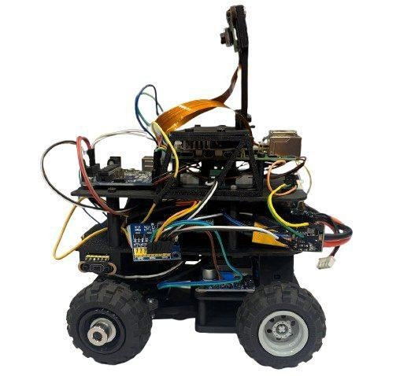</p>

### 1.1 The two challenges

In the **Open Challenge** the track is empty. The car drives three laps, takes twelve 90° corners, and stops in the section it started from. The direction is drawn at random before the round, and each corridor can be 600 mm or 1000 mm wide.

In the **Obstacle Challenge** red and green pillars are placed randomly. A red pillar is passed on its right, a green one on its left. After three laps the car finds the magenta plates and parks between them, parallel to the wall.

### 1.2 What we were aiming for

Finishing mattered more than being quick. For most of the season that meant a slow 200 RPM motor. Once the steering, the wall control and the power supply made the car repeatable, the motor became the limit on lap time, so we moved to a 600 RPM motor. Reliability came first; speed was added on top of it.

We split the two boards by how urgent their work is. Image processing is heavy and its timing wanders; steering corrections cannot wait. In the open round the Arduino needs nothing from the Pi. In the obstacle round it depends on the Pi for pillar decisions.

No single sensor is trusted alone. The side distance sensors give the walls, the gyro gives the heading, and the heading corrects the distance readings when the car is at an angle. If one distance sensor drops out, the car steers on the other and the gyro. Gyro drift is not yet caught automatically.

### 1.3 How a run works

| Stage | Where | What happens |
|---|---|---|
| Start-up | Pi and Arduino | Pi boots and starts our program automatically. Arduino calibrates the gyro, gives the three distance sensors their addresses, then waits for the start button |
| Direction | Arduino (open), Pi (obstacle) | Open: the closer side wall is the inside of the track. Obstacle: the camera reads the orange and blue floor lines |
| Lap driving | Arduino | Heading held on the gyro. Open: inner-wall PD, corner when the inner wall disappears. Obstacle: corner when the front sensor sees the wall ahead |
| Pillars | Pi decides, Arduino acts | Camera finds the nearest pillar and sends a steering command |
| Finish | Arduino | Open: twelve corners, stop. Obstacle: parking with encoder, distance sensors and gyro |

---

## 2. The Team

<p align="center">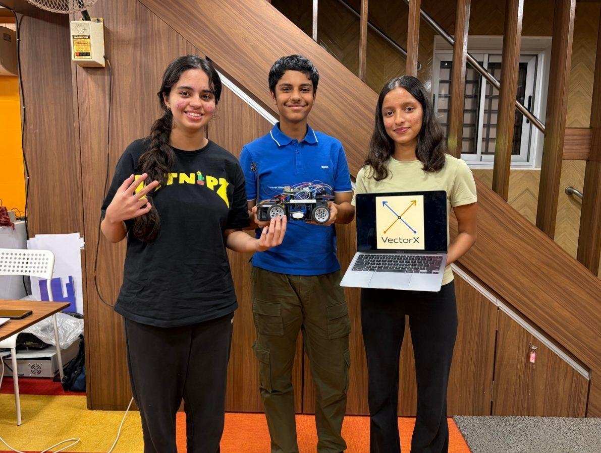</p>

| | |
|---|---|
|  | **Pratham Periwal — Electronics Lead.** Grade 10, Podar International School. “I love physics and programming, which is what led me into robotics. I like building projects and learning about new things.” Owns the power system, the wiring harness, and board-level debugging. |
|  | **Inaaya Sood — Computer Vision Lead.** Grade 9, SVKM JV Parekh International School. “I enjoy reading, coding, painting, and 3D designing, and I am always eager to explore new technologies.” Owns the camera pipeline, the HSV tuning, and the CAD. |
| 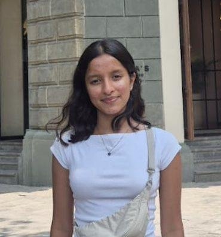 | **Swasti Kedia — Code Lead.** Grade 10, Podar International School, Powai. “I enjoy playing the piano, martial arts, reading, running, and exploring new fields. I like building things and doing hands-on work, which is what led me to robotics.” Owns the Arduino control loop, the state machine, and the sensor handling. |

**The name.** A vector has a direction and a magnitude — exactly the pair of numbers our car produces every few milliseconds: where to point the wheels and how fast to go. The X is for everything we are not told in advance: the pillar layout, the driving direction, and where the track is laid out. The logo draws that idea twice: two arrows crossing at a point.

---

## 3. The Vehicle

<p align="center">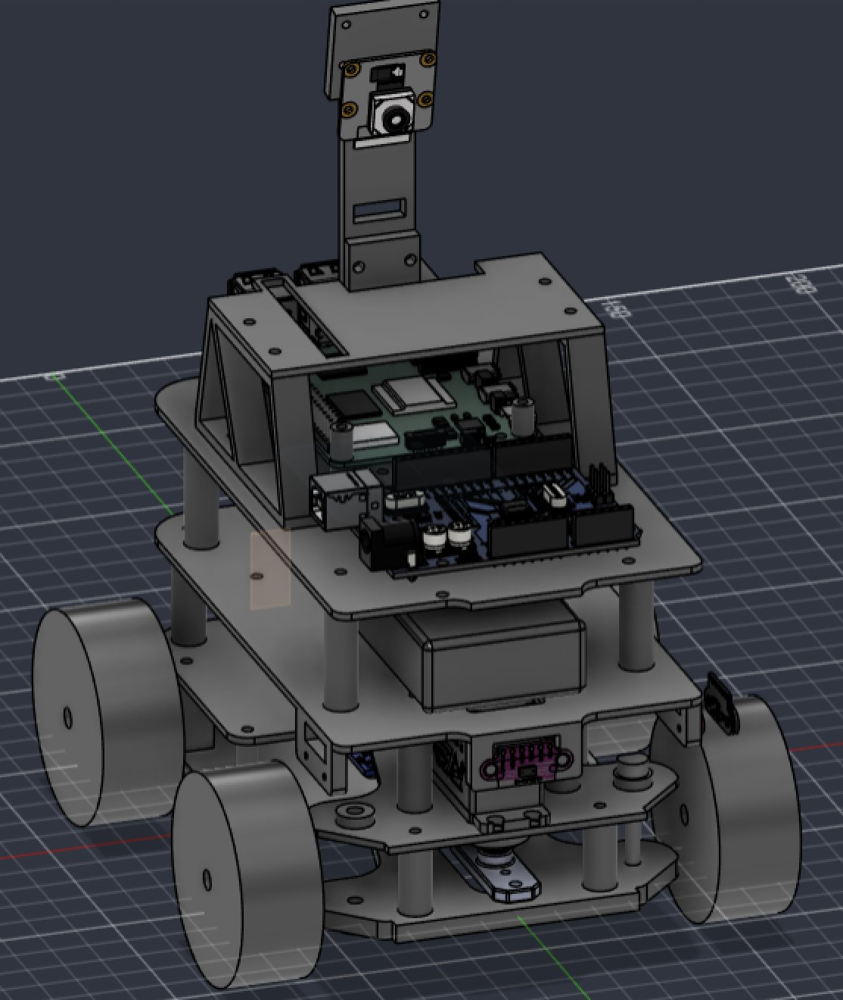</p>

The car went through four design revisions and five printed chassis before we stopped changing it.

| Spec | Value |
|---|---|
| Length × width × height | 225 × 140 × 230 mm |
| Weight | 0.9 kg |
| Wheels | 56 mm LEGO Technic |
| Compute | Raspberry Pi 5 (8 GB) + Arduino Uno |
| Steering | Front Ackermann, REV Smart Robot Servo |
| Servo travel | 85° centre, 55° full right, 115° full left (±30°) |
| Drive | Rear differential, N20 12 V 600 RPM motor with encoder |
| Motor driver | DFRobot TB6612FNG |
| Calculated top speed | 1.76 m/s (6.3 km/h), no-load |
| Measured three-lap time | 55.61 s CCW, 56.26 s CW (with the earlier 200 RPM motor) |

| Sensor or control | Used for |
|---|---|
| Pi Camera 3 Wide (12 MP, 120°) | Start direction, pillars, parking plates |
| VL53L0X × 3 | Left/right: wall distance. Centre: wall ahead — corner turns and crash prevention in the obstacle round |
| MPU-6050 | Heading, corner completion |
| N20 encoder | Distance travelled during parking |
| Start button (D4) | Starts the run |
| Red / green LEDs (A0, A2) | Distance ahead safe (green) or too close (red) |

### Photos

<p align="center">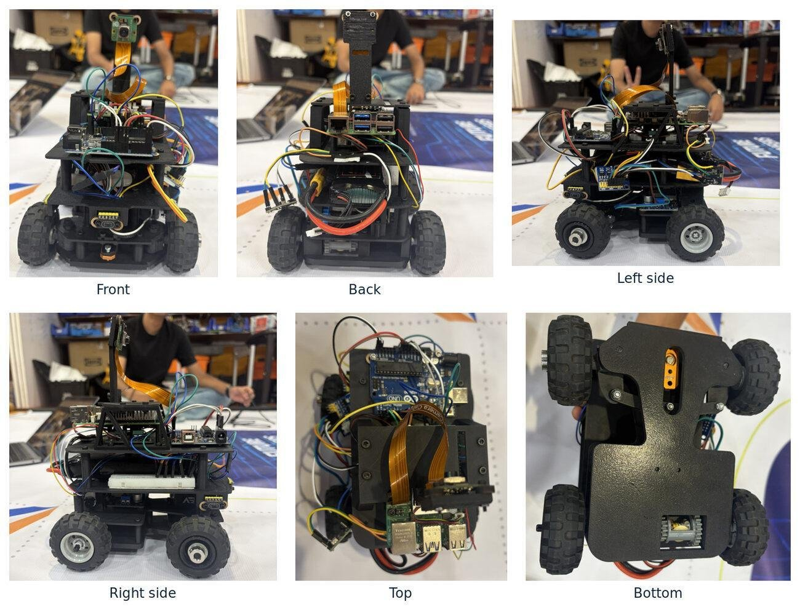</p>

Individual views are in [`Robot Photos/`](Robot%20Photos).

---

## 4. System Architecture

OpenCV on Linux does not run at a predictable rate, and a steering loop built on an unpredictable rate inherits the jitter. The Arduino loop is bare metal, so a reading and a servo command happen at the same point in every loop. In the open round the Arduino does not depend on the Pi at all.

| Job | Board |
|---|---|
| Camera capture, HSV masking, contours | Raspberry Pi 5 |
| Which pillar matters, which way to steer | Raspberry Pi 5 |
| Finding the parking plates | Raspberry Pi 5 |
| Reading three ToF, gyro, encoder | Arduino Uno |
| Heading control, wall PD, corner counting | Arduino Uno |
| Parking manoeuvre | Arduino Uno |
| Servo, motor, start button, LEDs | Arduino Uno |

The boards talk over USB serial at 115200 baud, ASCII, one command per line. The open-challenge program does not use the link. Each program is a single file, so there is never any doubt which file is live.

---

## 5. Mechanical and Mobility

### 5.1 Kinematics

Only the front wheels steer and only the rear wheels drive, so the car is non-holonomic. In a turn every wheel circles the same centre; Ackermann geometry turns the inner wheel further than the outer one so neither scrubs.

<p align="center">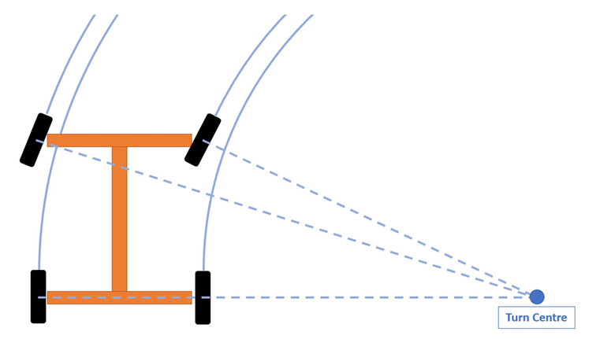 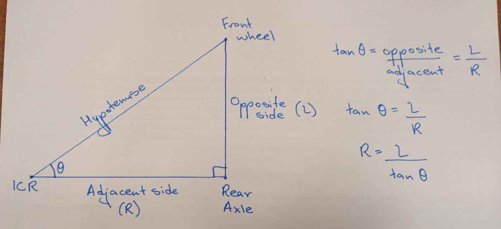</p>
<p align="center">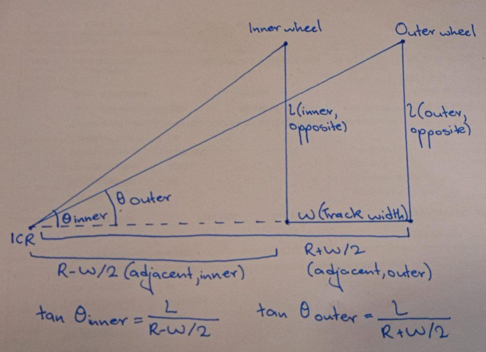</p>

| Formula | Gives |
|---|---|
| R = L / tan(δ) | Turning radius |
| tan(δ_inner) = L / (R − W/2) | Inner wheel angle |
| tan(δ_outer) = L / (R + W/2) | Outer wheel angle |
| cot(δ_outer) − cot(δ_inner) = W / L | Ackermann condition |
| R_min = L / tan(δ_max) | Tightest turn |

Our first linkage bound at about ±20°. The redesigned linkage runs the full ±30° freely.

### 5.2 Differential

<p align="center">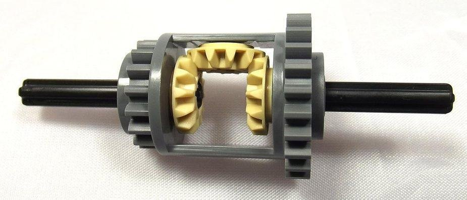</p>

One motor drives both rear wheels through a LEGO differential, so the wheels can turn at different speeds in a corner with no second motor and no code to match them. The trade-off: an open differential sends torque to the wheel with less grip. On a dry mat it has never cost us a run.

### 5.3 Steering

<p align="center">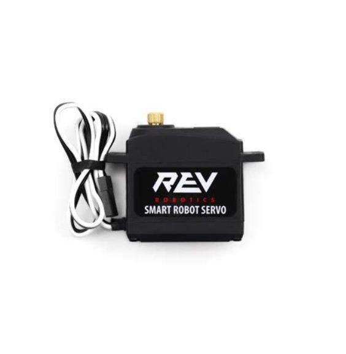</p>

SG90 → MG90S → REV Smart Robot Servo. The first two drifted and jittered, and we burnt one out with too much voltage. The REV servo has metal gears, far more torque, and holds its angle under load. Ackermann comes from angling the steering arms inward so lines through them meet near the rear axle. The redesigned linkage gives the full ±30°.

### 5.4 Motor and driver

<p align="center">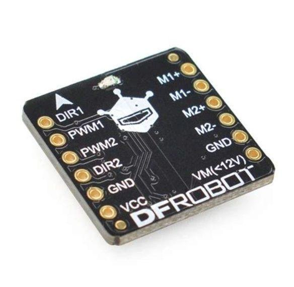</p>

N20 at 300 RPM bogged down in corners on the early car; 200 RPM drove evenly and stayed on while we made the car reliable. Once it finished the same way every time, the motor was the limit on lap time, so we moved to 600 RPM.

Driver: the L298N was bulky and noisy, the L298P dropped too much voltage. The TB6612FNG switches with MOSFETs, loses far less, runs cool and is tiny.

### 5.5 Speed

v = (π × D × N) / 60 = (π × 0.056 × 600) / 60 = **1.76 m/s** — the theoretical no-load figure. The car runs at 210/255 PWM on straights, so real speed is lower.

### 5.6 Chassis and revisions

3D printed so mounts are part of the plate, and so a change in the morning can be driven that evening. The battery sits low; the Pi and Arduino are on the upper deck where they can be reached. The camera tower is stiff because vibration blurs frames.

<p align="center">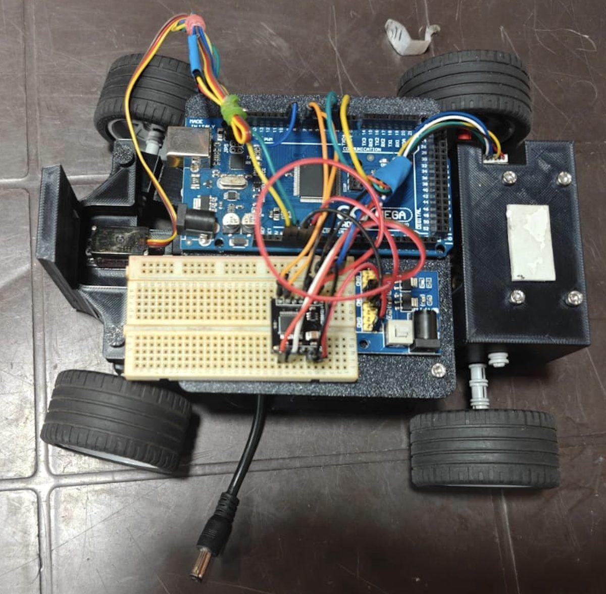 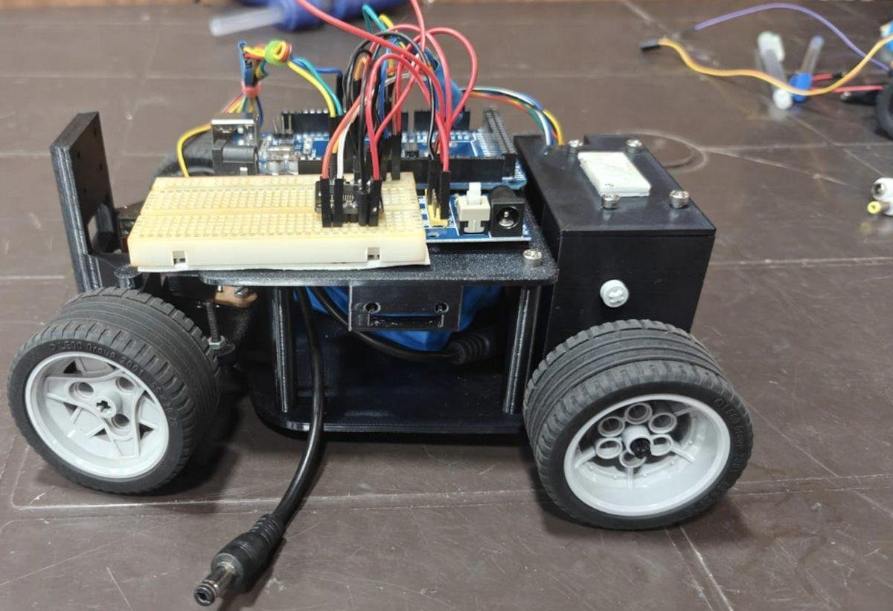</p>

| Rev | What changed | Why |
|---|---|---|
| v1 | Base plate with Pi, Arduino and motor mounts | Component fit and wiring routes |
| v2 | Printed Pi stand, ToF and camera mounts | Tape let parts shift mid-run |
| v3 | Encoder, TB6612FNG, separate servo supply | Parking, and fixing voltage problems |
| v4 | Steering linkage redesigned, 600 RPM motor | ±20° binding removed; faster laps |

---

## 6. Power and Sensors

### 6.1 Power distribution

Each kind of load gets its own regulator, and every ground is common.

<p align="center">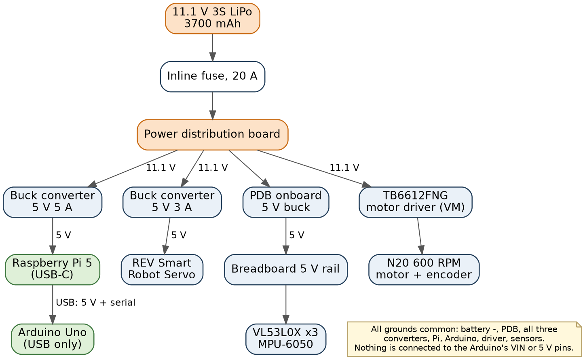</p>

| Domain | Supply | Loads |
|---|---|---|
| Motor | 11.1 V from the distribution board | TB6612FNG → N20 |
| Servo | 5 V 3 A buck | REV servo |
| Pi | 5 V 5 A buck | Pi 5, and the Arduino over USB |
| Sensors | Distribution board's onboard 5 V buck, via a breadboard rail | 3 × VL53L0X, MPU-6050 |

The Arduino is powered only by USB from the Pi — nothing on its 5 V or VIN pins. A 20 A inline fuse between battery and distribution board is there to blow on a short circuit, not to limit running current.

### 6.2 Current budget

| Component | Qty | V | Typical | Peak | Rail |
|---|---|---|---|---|---|
| Raspberry Pi 5 | 1 | 5.0 | 1.50 A | 3.00 A | 5 V 5 A buck |
| Arduino Uno | 1 | 5.0 | 0.05 A | 0.10 A | Pi USB |
| REV servo | 1 | 5.0 | 0.20 A | 2.00 A | 5 V 3 A buck |
| VL53L0X | 3 | 5.0 | 0.06 A | 0.12 A | PDB 5 V buck |
| MPU-6050 | 1 | 5.0 | 0.01 A | 0.02 A | PDB 5 V buck |
| N20 drive motor | 1 | 11.1 | 0.30 A | 1.50 A | TB6612 |

Currents at different voltages cannot be added, so we work in power. 5 V loads: 9.1 W typical, 26.2 W peak. At about 90% converter efficiency that is 0.91 A and 2.62 A from the 11.1 V pack. With the motor: **about 1.2 A typical, 4.1 A peak** at the battery. Leaving 20% in the pack: 3.7 Ah × 0.8 / 1.2 A ≈ **2.4 hours**.

### 6.3 Why these sensors, and where they sit

| Part | Reason |
|---|---|
| Pi Camera 3 Wide | 120° sees the near floor line and a distant pillar in one frame |
| VL53L0X | Millimetre resolution to about a metre; much less affected by room light than the IR reflectance sensors we tried |
| MPU-6050 | Z-axis rate is all we need for heading |
| Encoder | Distance travelled for parking |

Side ToF sensors face straight left and right; the centre one faces forward. The IMU is mounted flat so its Z axis is the car's yaw axis — a gyro reads the same turn rate anywhere on a rigid chassis, so being level and firmly fixed is what matters.

**Field geometry.** Corridors are 600 or 1000 mm (±100 mm at the international final) and the car is 140 mm wide, so the side sensors see about 460 or 860 mm of free space. The wall target (a third of the outer distance) puts the car about a quarter of that from the inner wall: ~115 mm narrow, ~215 mm wide. The 1000 mm "wall lost" threshold sits above the most the inner sensor can read across a straight (~960 mm in an 1100 mm corridor), while at a corner it looks down the next straight and reads far past it.

### 6.4 Calibration

Gyro: 500 samples at 10 ms at every power-on, averaged and subtracted; ±500 °/s range, ~42 Hz low-pass. It all happens automatically before the car waits for the start button. ToF: checked against a flat target at 200 mm. Camera: HSV tool ([10.3](#103-colour-calibration)).

### 6.5 Sensor failures

| Failure | How we notice | What the car does |
|---|---|---|
| One side ToF invalid | Timeout flag, or 0 / 8191 / 65535 | Dropped from the PD; steer on the other wall + gyro |
| Both side ToF invalid | Neither valid | PD skipped; hold heading on gyro alone |
| Inner wall > 1000 mm, 5 loops | Distance check | Treated as a corner, not a fault |
| Gyro drift | Heading disagrees with walls | Not yet detected — our weakest point |

### 6.6 Wiring

<p align="center">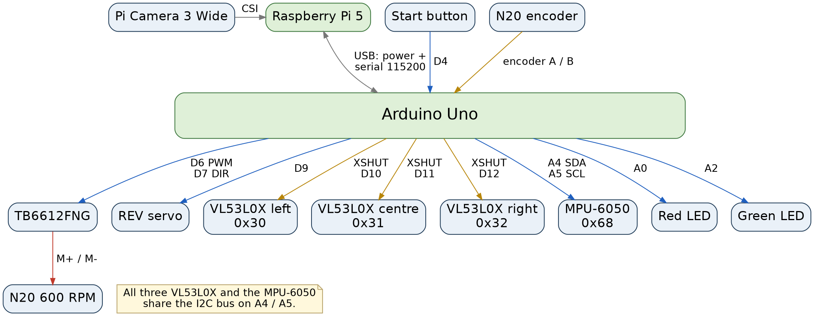</p>

Before connecting the battery we check: every ground is common; nothing feeds the Arduino except USB; XSHUT lines are on D10, D11, D12.

---

## 7. Software

### 7.1 Start-up

When the car is switched on, the Pi boots and starts our program automatically; no wireless link is used. The Arduino sets the MPU-6050 range and filter, then brings up the three VL53L0X one at a time: all held in reset via XSHUT, then left → 0x30, centre → 0x31, right → 0x32. It calibrates the gyro and waits for the button on D4. In the open round it then takes the closer side wall as the inside of the track.

### 7.2 The control loop (open round)

<p align="center">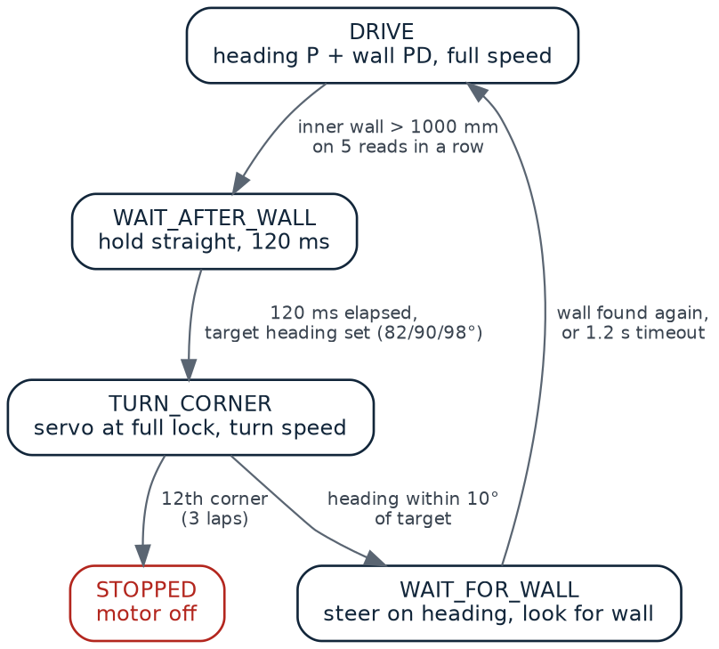</p>

In DRIVE the servo angle is centre (85°) plus two corrections:

- **Heading term** — gyro heading error × 1.2. Keeps the car straight and pulls it back on line after a corner.
- **Wall term** — PD with both gains at 0.12 on the inner-wall distance. Target is a third of the outer distance when both walls are visible, 250 mm when only one is. Clamped to ±15° so it trims the car but never overrides the heading term.

Both distances are multiplied by the cosine of the heading error (floored at 0.2) because an angled sensor reads a longer path than the real gap. The derivative is skipped on the first loop to avoid a start-up twitch.

### 7.3 Corners

**Open round.** A corner is when the inner sensor reads over 1000 mm on five consecutive loops. Detection is ignored for 350 ms after re-entering DRIVE. The car goes straight 120 ms more, then turns at full lock to a new heading: 90°, cut to 82° if it was closer than 160 mm to the wall, stretched to 98° if further than 400 mm. The turn ends within 10° of target; the car then reacquires the wall (1.2 s timeout). Twelve corners = three laps.

**Obstacle round.** Pillars can hide the gap, so the centre sensor decides: under 700 mm on two readings → turn to the next gyro heading, stopping 5° early for overshoot; front sensor ignored for 300 ms after each turn.

### 7.4 The obstacle program

The Pi builds HSV masks for red (two hue ranges), green, magenta and the floor lines, cleans them with a 5 × 5 elliptical kernel, and ignores the top 20% of the frame. Walls, lines and glare used to pass as pillars, so candidates must pass a shape filter:

| Filter | Value | Why |
|---|---|---|
| Minimum area | 300 px | Specks and distant noise |
| Height / width | > 0.9 | Pillars are tall; walls and lines are wide |
| Maximum width | 260 px | Anything wider is a wall |
| Floor lines | area ≥ 2000 px, w/h ≥ 2.0 | Recognised separately from pillars |

The nearer pillar wins. Frame columns at 15 / 50 / 85 % set how hard the car steers.

<p align="center">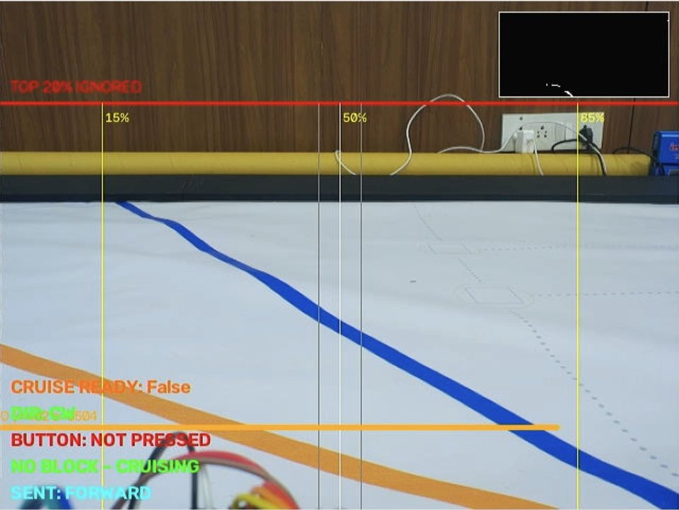</p>

*Debug view: top 20% ignored, 15/50/85% columns, direction, button state, pillar status, last command.*

### 7.5 Parking

The lot is 1.5 × car length (~340 mm). Full points need the car fully inside, parallel within 2 cm, without touching the plates. The Pi finds the magenta plates (bounding box, centre, area — area doubles as distance, position gives the side). The Arduino runs the manoeuvre with the encoder, distance sensors and gyro.

### 7.6 Serial link

115200 baud, one command per line; for example, `FORWARD` means no pillar is in the way. The open-challenge program does not use the link.

### 7.7 Libraries

Pi: Python 3.11, picamera2, opencv-python, numpy, pyserial. Arduino: Wire.h, Servo.h, Pololu VL53L0X (simpler `setAddress()` for several sensors on one bus).

---

## 8. Navigation Strategy

**Direction.** Open round: the closer side wall is the inside — free, and immune to lighting. Obstacle round: the camera compares how low the orange and blue lines sit in the frame; the nearer line decides.

**Wall following.** A long inner reading is information, not an error — five of them mean a corner. A target relative to the outer wall adapts to 600 or 1000 mm corridors.

**Things that used to go wrong.** Gyro bias integrated into a slow rotation → five-second calibration, integrate only while moving. Corners counted twice → 350 ms grace period. Angled ToF readings → cosine correction (our hardest bug). Wall never reacquired → 1.2 s timeout.

---

## 9. Engineering Decisions

**Constraints.** Fit 300 × 200 × 300 mm and 1.5 kg (we are 225 × 140 × 230 mm, 0.9 kg); one driving axle and a steering actuator; one power switch, one start button, no wireless; easy to open up.

**Decisions we would make again.** Rear-wheel drive; one motor and a differential; a separate microcontroller for timing; the wide camera; reliability first, then speed.

| Part | Now | Before | Why |
|---|---|---|---|
| Camera | Pi Camera 3 Wide | HuskyLens, Pixy | We wanted to write the detection ourselves |
| Motor driver | TB6612FNG | L298N, L298P | Voltage drop and noise |
| Distance sensor | VL53L0X | VL53L1X | L1X unreliable in our setup |
| Drive motor | N20 600 RPM | 300 RPM, then 200 RPM | 300 lacked torque then; 200 limited lap time once control was solid |
| Servo | REV Smart Robot Servo | SG90, MG90S | Torque, drift, jitter, one burnt out |
| Wheels | 56 mm LEGO | 43 mm printed | Clearance and grip |
| Steering | Ackermann, ±30° | Rack, parallel, ±20° linkage | Binding, scrubbing, limited turn |
| Servo supply | Own 5 V 3 A | Shared rail | Brown-outs |

| Risk | Mitigation |
|---|---|
| Battery sag | Check voltage before every run; swap packs |
| Loose wiring | Routed harness; pre-power check |
| Camera vibration | Stiff tower, checked after sessions |
| Lighting on the day | Re-tune HSV on the competition floor |
| Gyro disturbed at start | Place, switch on, don't touch until calibrated |
| Duplicate ToF addresses | I2C scan in the pre-run check |

---

## 10. Testing and Results

### 10.1 How we test

Bottom-up: every component tested alone, then in pairs, then the whole car. Most real bugs only showed up on full runs.

### 10.2 Component and subsystem tests (`Component_test_code/`)

| Test | Checks |
|---|---|
| `Servo_test.ino` | Travel limits and jitter |
| `motor_test.ino` | Direction and PWM response |
| `single_tof.ino` / `Double_tof.ino` | One sensor, then XSHUT readdressing |
| `mpu_heading_test.ino` | Bias calibration and drift |
| `Pi_cam.py` | Capture and frame rate |
| `Hsv_calibration_test.py` | Interactive HSV range finder |
| `orange_blue_test.py`, `red_green_test.py`, `pink_plate_parking.py` | Direction lines, pillars, parking plates |
| `output_pin.ino` | Every output pin |
| `I2C.ino` | 0x30, 0x31, 0x32, 0x68 all answer |
| `motor_servo_test.ino` | Manual driving over serial |
| `hardware.ino` | Pass/fail on servo, motor, three ToF, MPU, button, LEDs — our pre-run check |
| `pi_diagnostics.py` | Camera, serial, FPS (flags < 20 FPS) |

### 10.3 Colour calibration

<p align="center">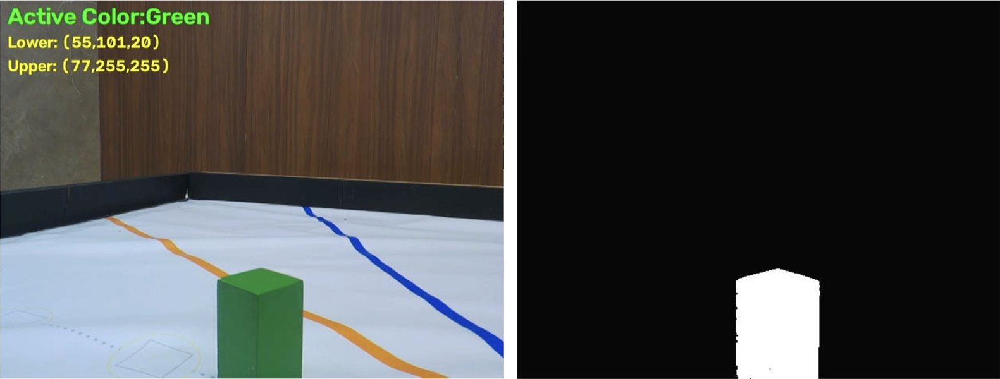</p>

*Tuning green — these are the final green values.*

<p align="center">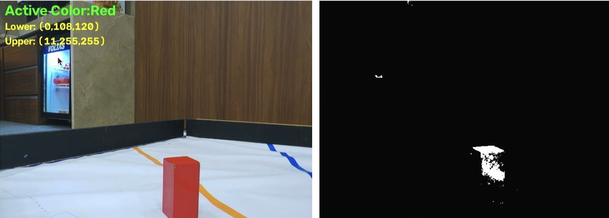</p>

*A red tuning session. The final values below were tightened in code: lowering the brightness floor from 120 to 70 brings the shaded face of the pillar back into the mask.*

| Colour | Hue | Saturation | Value |
|---|---|---|---|
| Red (1) | 0–8 | 130–255 | 70–255 |
| Red (2) | 165–180 | 130–255 | 70–255 |
| Green | 55–77 | 101–255 | 20–255 |
| Magenta | 132–170 | 100–255 | 100–255 |
| Orange line | 10–25 | 100–255 | 100–255 |
| Blue line | 94–126 | 80–255 | 80–255 |

The green range used to reach hue 179, so it accepted cyan and magenta — including the parking plates — as green. Narrowing it to 55–77 fixed it.

### 10.4 Measured results

Three-lap open-challenge runs with the 200 RPM motor: clockwise 56.26 s (laps 18.71 / 17.36 / 17.05 s); counter-clockwise 55.61 s (16.88 / 17.65 / 16.14 s). Laps within ~1.5 s of each other and directions within a second — repeatable and symmetric.

<p align="center">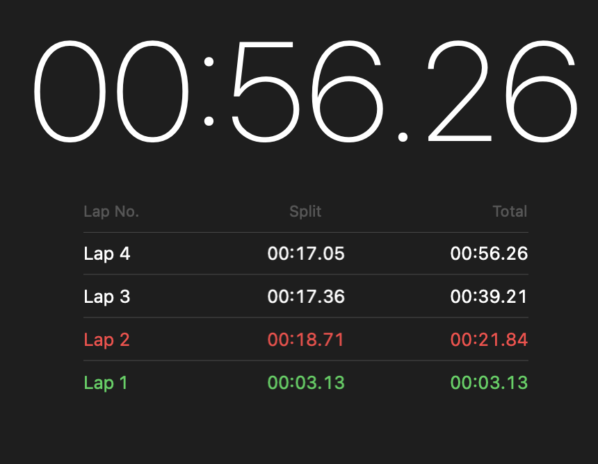 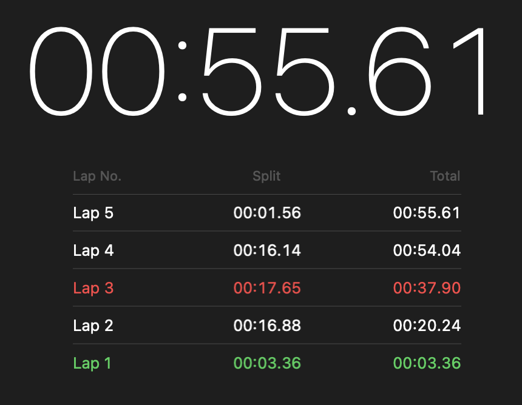</p>

### 10.5 Problems and fixes

| Problem | Cause | Fix |
|---|---|---|
| Servo jittered, then failed | Over-voltage | REV servo on its own 5 V 3 A rail |
| Rear axle snapped | Printed shaft too weak | Reprinted thicker |
| Car curved into the inner wall | Angled ToF reads long | Cosine of heading error, floored at 0.2 |
| Red and green swapped | BGR vs RGB | Fixed channel order |
| Green mask caught parking plates | Hue up to 179 | Green hue 55–77 |
| Walls and lines seen as pillars | Colour alone | Shape filter |
| Steering limited to ±20° | Linkage bound | Redesigned linkage, ±30° |
| Start-up steering twitch | False derivative | Skip D on first loop |
| Corners counted twice | Same gap seen twice | 350 ms grace period |

**Known limitations.** Gyro drift is not detected. The open differential could slip on a slippery surface.

---

## 11. Reproducing VectorX

### 11.1 Bill of materials

| Item | Spec | Qty | Unit (₹) | Total (₹) |
|---|---|---|---|---|
| Raspberry Pi 5 | 8 GB | 1 | 24,000 | 24,000 |
| Pi power supply | Official USB-C, bench only | 1 | 1,400 | 1,400 |
| Pi Camera 3 Wide | 12 MP, 120° | 1 | 4,500 | 4,500 |
| Arduino Uno + USB cable | | 1 | 500 | 500 |
| TB6612FNG | DFRobot | 1 | 350 | 350 |
| VL53L0X | I2C | 3 | 490 | 1,470 |
| Buck 5 V 5 A / 5 V 3 A | Pi / servo | 2 | 250 | 500 |
| N20 600 RPM + encoder | 12 V | 1 | 450 | 450 |
| MPU-6050 | | 1 | 150 | 150 |
| LEGO differential | | 1 | 2,000 | 2,000 |
| REV Smart Robot Servo | | 1 | 5,000 | 5,000 |
| Power distribution board | Onboard 5 V buck | 1 | 250 | 250 |
| Breadboard | Sensor rail | 1 | 100 | 100 |
| 3S LiPo 3700 mAh | | 1 | 2,200 | 2,200 |
| Chassis prototypes | per revision | 5 | 1,500 | 7,500 |
| Final chassis | | 1 | 1,500 | 1,500 |
| Wheels | 56 mm | 4 | 120 | 480 |
| Miscellaneous | Test parts, alternatives, wire | 1 | 10,000 | 10,000 |
| **Total** | | | | **62,350** |

### 11.2 CAD

The car we ran at the national final, and the Asia Pacific car.

<p align="center">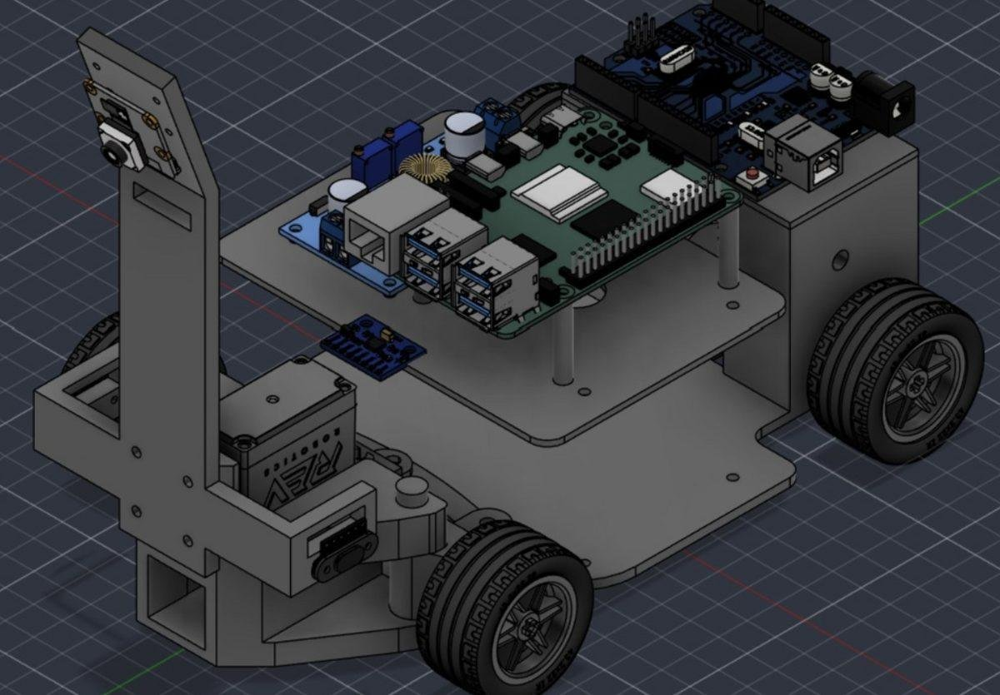 </p>

### 11.3 Pin map

| Pin | Connected to |
|---|---|
| D4 | Start button |
| D6 | Motor PWM |
| D7 | Motor direction (LOW = forward) |
| D9 | Servo signal |
| D10 / D11 / D12 | Left / centre / right VL53L0X XSHUT |
| A0 / A2 | Red / green LED |
| A4 / A5 | I2C SDA / SCL (three ToF + MPU) |
| USB | Serial to Pi; the Arduino's only power |

| I2C address | Device |
|---|---|
| 0x30 / 0x31 / 0x32 | Left / centre / right VL53L0X (assigned at boot) |
| 0x68 | MPU-6050 |

### 11.4 Software setup

```bash
sudo apt update && sudo apt full-upgrade -y
sudo apt install -y python3-opencv python3-picamera2
pip install pyserial numpy --break-system-packages
git clone https://github.com/PeriwalPratham/VectorX.git ~/vectorx
```

Disable the radios for competition — add to `/boot/firmware/config.txt` and reboot:

```
dtoverlay=disable-wifi
dtoverlay=disable-bt
```


Arduino: Arduino IDE 2.x, AVR Boards package, Pololu VL53L0X library. Select Arduino Uno, verify, upload. The sketch runs from flash on every power-up.

### 11.5 Constants

| Constant | Value | What it does |
|---|---|---|
| `STRAIGHT`, `RIGHT`, `LEFT` | 85, 55, 115 | Servo centre and limits |
| `DRIVE_SPEED`, `TURN_SPEED` | 210, 180 | PWM straights / corners |
| `KP_STRAIGHT` | 1.2 | Heading gain |
| `KP_WALL`, `KD_WALL` | 0.12, 0.12 | Wall PD |
| `DEFAULT_INNER_SETPOINT` | 250 mm | One-wall target |
| `WALL_LOST_THRESHOLD` / `_CONFIRM_COUNT` | 1000 mm / 5 | Corner detection (open) |
| `WAIT_AFTER_WALL_MS` | 120 ms | Straight before turning |
| `DRIVE_GRACE_PERIOD_MS` | 350 ms | Stops double-counting |
| `TURN_TOLERANCE` | 10° | Turn complete |
| Front corner distance | 700 mm | Corner trigger (obstacle) |
| `FRONT_STOP_CONSECUTIVE` | 2 | Readings to confirm (obstacle) |
| `FRONT_IGNORE_AFTER_TURN_MS` | 300 ms | Lockout after a turn (obstacle) |
| `TURN_STOP_EARLY` | 5° | Overshoot allowance (obstacle) |
| `MIN_BLOCK_AREA` | 300 px | Smallest pillar |
| `MIN_BLOCK_ASPECT`, `MAX_BLOCK_WIDTH` | 0.9, 260 px | Pillar shape filter |

### 11.6 Calibration and running

**Before a run:** wheels off the ground, servo to 85°, adjust linkage to dead ahead; check each ToF at 200 mm; re-check HSV under the real lighting; run `I2C.ino` (four addresses) and `hardware.ino` (all pass).

**Running:** place the car in the start zone switched off. Switch on and leave it alone — the Pi starts our program, the Arduino sets up sensors and calibrates the gyro, then waits. On the judge's "Go", press the button on D4. No keyboard, laptop or wireless link is used.
